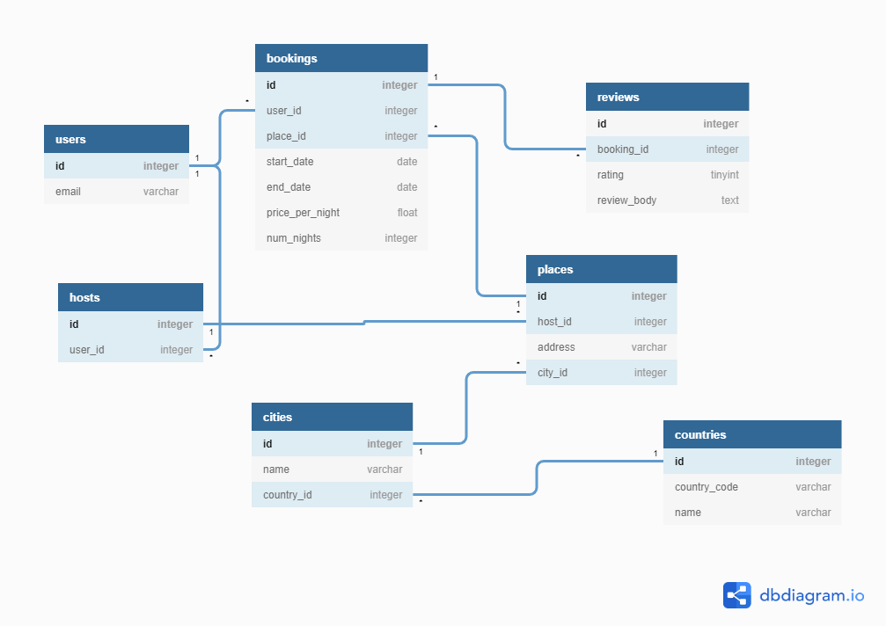

# <center> Tworzenie tabel w bazach danych </center>

Skrypt ten opisuje proces tworzenia tabel w bazie danych za pomocą SQL.

Załóżmy, że chcemy stworzyć tabele:


- Author

| id 	| name      	| surname       	| born_date  	|
|:--:	|:-----------:	|:---------------:	|:------------:	|
| 1  	| William   	| Shakespeare   	| 26.04.1564 	|
| 2  	| Albert    	| Camus         	| 7.11.1913  	|

- Book

| id 	| id_author 	| original_title 	| publication_date 	| original_language 	|
|:--:	|:---------:	|:--------------:	|:----------------:	|:-----------------:	|
|  1 	|     1     	|     Hamlet     	|       1603       	|      english      	|
|  2 	|     1     	|    King Lear   	|       1606       	|      english      	|
|  3 	|     2     	|    La Peste    	|       1947       	|       french      	|


### Tworzenie struktury tabel

Do tworzenie nowych tabel w sposób podstawowy w SQL używamy polecenia:

```sql
CREATE TABLE [schemat.] nazwa_tabeli
(
    col_name_1 datatype [constraint],
    col_name_2 datatype [constraint],
	col_name_3 datatype [constraint],
    ...    
);
```

gdzie:
- col_name_n - to nazwa kolumny
- datatype - to deklaracja typu kolumny
- constraint - to ograniczenia które ma spełniać kolumna, nadawanie ograniczeń jest opcjponalne i zostaną omówione w dalszej części skryptu.

W sposób podstawowy możemy zatem zadeklarować tabele Author i Book w następujący sposób:

```sql
CREATE TABLE author
(
	id integer,
	name character varchar(50),
	surname character varchar(50),
  	born_date date
);

CREATE TABLE book
(
	id integer,
	id_author integer,
	original_title varchar(150),
	publication_date int,
	original_language varchar(50)
);
```

Jak możemy zauważyć nie uwzględniono tutaj ograniczeń i zależności między tabelami. Warto wspomnieć, że zarówno klucze podstawowe jak i obce są również z punktu bazy danych ograniczeniami.

#### Ograniczenia

Ograniczenia służą do określenia reguł dotyczących danych które mogą zostać wprowadzone do tabeli. Zapewnia to dokładność i wiarygodność danych w tabeli. Jeśli pomiędzy ograniczeniem a akcją dotyczącą danych nastąpi naruszenie, akcja zostanie przerwana. Ograniczenia mogą dotyczyć poziomu kolumny lub poziomu tabeli. 

W języku SQL powszechnie stosowane są następujące ograniczenia:

- NOT NULL — zapewnia, że kolumna nie może mieć wartości NULL.
- UNIQUE — zapewnia, że wszystkie wartości w kolumnie są różne.
- PRIMARY KEY — kombinacja NOT NULL i UNIQUE. Unikalnie identyfikuje każdy wiersz w tabeli.
- FOREIGN KEY - deklaracja relacji między tabelami
- CHECK — sprawdza, czy wartości w kolumnie spełniają określony warunek
- DEFAULT — ustawia domyślną wartość kolumny, jeśli nie określono żadnej wartości
- CREATE INDEX - Służy do tworzenia indeksu wykorzystywanego do szybkiego pobierania danych z bazy danych

Uwzględniając ograniczenia w tabelach deklaracja będzie miała postać:

```sql
CREATE TABLE author
(
    id integer PRIMARY KEY,
    name  varchar(50) CHECK(length(author.name) > 0),
    surname  varchar(50) CHECK(length(author.surname) > 0),
    born_date date NOT NULL
);

CREATE TABLE book
(
	id integer PRIMARY KEY,
	id_author integer NOT NULL,
	original_title varchar(150) CHECK(length(book.original_title) > 0),
	publication_date int,
	original_language varchar(50) CHECK(length(book.original_language) > 0),
	FOREIGN KEY (id_author) REFERENCES author(id)
);
```


## Modyfikowanie tabel

Należy pamiętać, że tabele które już istnieją nie mogą zostać nadpisane przez deklarację _CREATE TABLE_. Modyfikację tabel można dokonywać za pomocą polecenia _ALTER_. Umożliwia ono:
- dodawanie kolumn

```sql
ALTER TABLE table_name
ADD column_name datatype;
```

- usuwanie kolumn

```sql
ALTER TABLE table_name
DROP COLUMN column_name;
```

- zmianę nazw kolumn

```sql
ALTER TABLE table_name
RENAME COLUMN old_name to new_name;
```

- modyfikowanie kolumn

```sql
ALTER TABLE table_name
ALTER COLUMN column_name datatype [constraint];
```

## Usuwanie tabel
Jeżeli chcemy jednak usunąć tabelę należy użyć polecenia:

```sql
DROP TABLE table_name;
```

Należy jednak pamiętać, że ze względu na klucze obce proces ten nie zawsze jest możliwy i należy przeprowadzać go bardzo ostrożnie.


## Ćwiczenie
Używając Pythona i bibliotek Pandas lub SQLAlchemy  napisz skrytp który utworzy strukturę tabel w następujący sposób:


Do wykonania ćwiczenia użyj bazy MySQL dostępnej w [panel AGH](https://panel.agh.edu.pl). Pamiętaj, że dostęp do niej wymaga VPN. 
